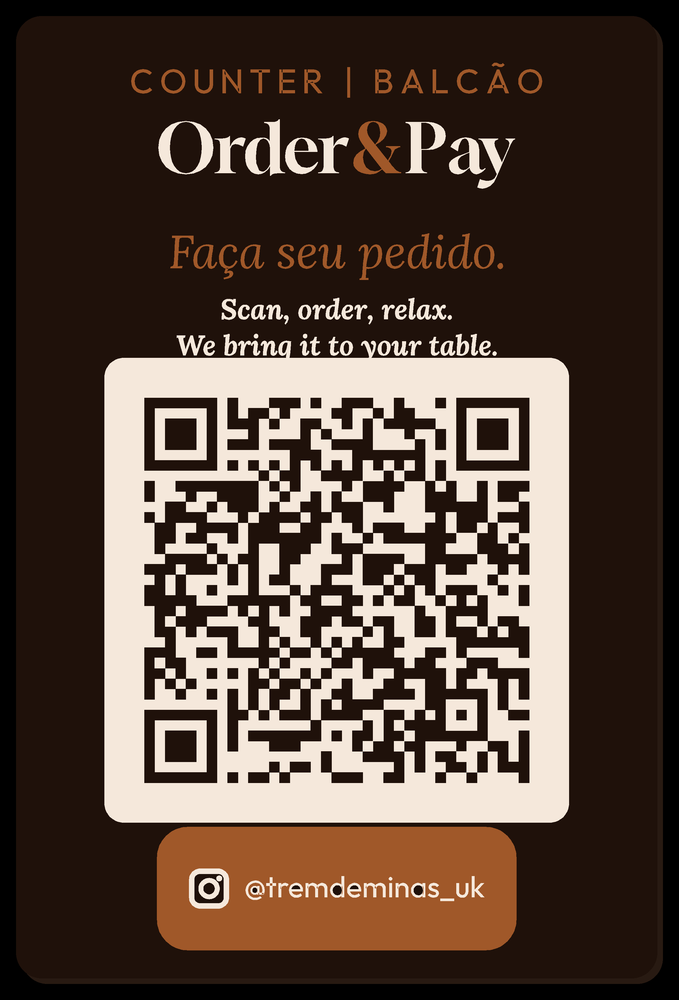
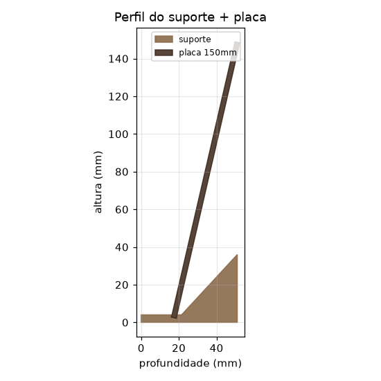

# Order & Pay — Placa QR + suporte para impressão 3D (Trem de Minas)

Arquivos CAD multicor da placa **"Order & Pay"** com QR code **funcional**, mais um
**suporte (cavalete)** para deixá-la em pé no balcão/mesa. Pronto para impressão 3D
com troca de cor (Bambu Lab + AMS, ou troca manual de filamento por camada).



## Texto 100% vetorial

Todos os textos são gerados a partir de **fontes vetoriais reais** (contornos lisos),
não traçados de imagem — por isso as letras saem nítidas, sem serrilhado, e otimizadas
para impressão. Fontes usadas:

- **Order & Pay** → Gloock (serifa display, estilo do original)
- **COUNTER | BALCÃO** e **@tremdeminas_uk** → Outfit (sans)
- **Faça seu pedido.** → Lora Italic
- **Scan, order, relax. / We bring it to your table.** → Lora BoldItalic

## QR code

O QR é gerado a partir da URL real como geometria de módulos nítidos, então continua
escaneável depois de impresso. Leitura validada na arte e na geometria final.

- Conteúdo: `https://app.tremdeminas.uk/menu/a9ca755a-b451-4786-91cb-a4630bbb17b2`
- 37 × 37 módulos · módulo de ~1,62 mm nesta escala

## Especificações de impressão

| Item | Valor |
|------|-------|
| Tamanho da placa | **100 × 150 mm** |
| Espessura da placa | **2,6 mm** (base marrom 2,0 mm + camada de cor 0,6 mm) |
| Cores (AMS) | Marrom (fundo), Branco (texto e QR), Laranja (detalhes) |
| Orientação da placa | Deitada, **frente para cima** (face colorida no topo) |
| Suporte | Peça separada, ~88 × 51 × 36 mm, canaleta inclinada ~13° |
| Bico recomendado | 0,2 mm (com 0,4 mm também imprime bem) |
| Filamento sugerido | PLA (texturizado) |

> **Dica:** para melhor leitura do QR, mantenha bom contraste e evite filamentos
> muito brilhantes na face.

## Suporte

A placa **encaixa em pé** na canaleta inclinada do suporte (cavalete). Imprima o
suporte separado, em pé na orientação modelada (cor à sua escolha). Veja o perfil:



## Arquivos

```
cad/
├── order_pay_plaque.3mf        ← só a placa (3 cores) — abrir no Bambu Studio
├── order_pay_set_100x150.3mf   ← placa (3 cores) + suporte juntos na mesa
├── stl/
│   ├── 01_marrom_base.stl      ← base + fundo + módulos escuros do QR  → MARROM
│   ├── 02_branco.stl           ← texto, painel e módulos claros do QR  → BRANCO
│   ├── 03_laranja.stl          ← "COUNTER | BALCÃO", &, "Faça seu pedido", pílula @  → LARANJA
│   └── 04_suporte.stl          ← cavalete/base (imprimir separado)
├── preview/
│   ├── mockup.png · design_flat.png · suporte_perfil.png
└── src/
    ├── build_design.py         ← gera a placa (vetorial): build_design.py "<URL>" 100 150
    ├── extrude.py              ← extruda a placa em STL/3MF
    ├── build_stand.py          ← gera o suporte: build_stand.py 100 150 2.6
    ├── vlib.py                 ← util: texto -> contorno vetorial (shapely)
    └── fonts/                  ← fontes usadas (Gloock, Outfit, Lora Italic/BoldItalic)
```

As 3 partes da placa compartilham a **mesma origem**, então encaixam perfeitamente.

## Como imprimir

### Placa (multicor)
1. Abra `order_pay_plaque.3mf` no **Bambu Studio** / OrcaSlicer.
2. Atribua um filamento a cada parte: `brown` → marrom, `white` → branco,
   `orange` → laranja.
3. Mantenha **frente para cima** (face do QR no topo da mesa). Fatie e imprima.

### Suporte
- Imprima `stl/04_suporte.stl` separado. Depois é só **encaixar a placa na canaleta**.
- Para imprimir os dois de uma vez, use `order_pay_set_100x150.3mf`.

## Regenerar / trocar o QR ou o tamanho

```bash
pip install pillow numpy opencv-python-headless trimesh shapely mapbox_earcut scipy qrcode manifold3d matplotlib
cd cad/src
python3 build_design.py "https://app.tremdeminas.uk/menu/<ID>" 100 150   # gera vec_geom.pkl + preview
python3 extrude.py                                                       # gera os STL/3MF
python3 build_stand.py 100 150 2.6
```

Troque a URL e o tamanho (largura altura em mm) conforme necessário — o QR é gerado
e validado automaticamente.
